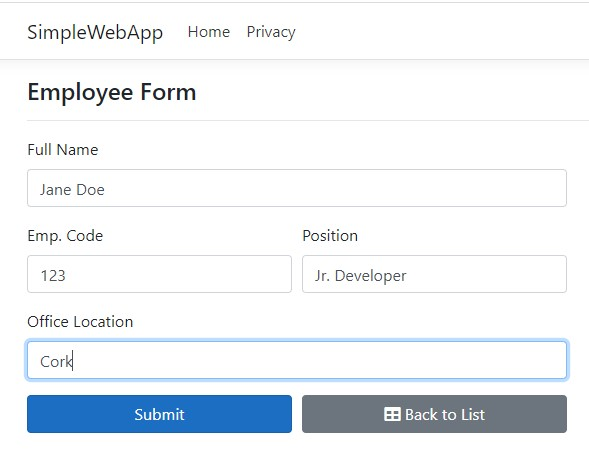
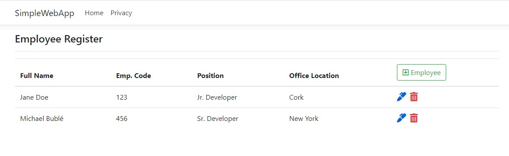

<h1 align = "center"> WebApp Asp.NetCore </h1>

### 🛠 Technologies used:
* Asp .Net Core
* Entity Framework Core
* Bootstrap

### 📖 Practiced:
* Connecting Database to Solution
* How to create a database using Entity Framework Core
* How to use MVC Controller Scaffolded with views
* Implementation of CRUD methods

### Result:
Add new employee

List of employees

